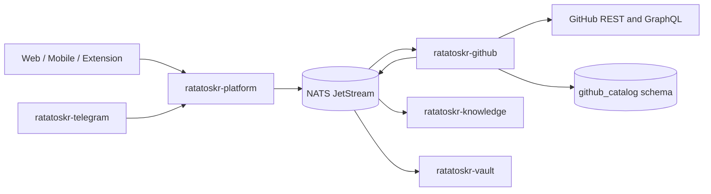
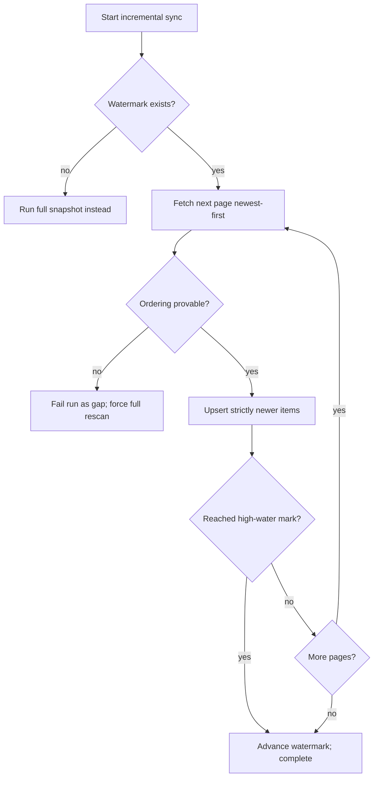
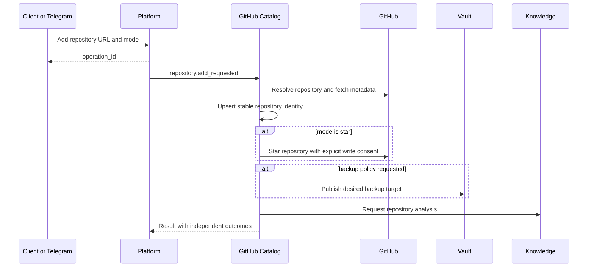

# Ratatoskr GitHub Catalog Architecture

> Status: target architecture. The Rust service foundation, operator routes, current
> `github_catalog` schema, and CI gate are implemented. Repository identity, mutable aliases
> with redirect history, metadata projection with conditional requests, per-token rate-limit
> accounting, and bounded revision history are implemented (implementation plan items 1 and 3),
> as are full star snapshots: complete enumeration under rate budgets, resumable checkpoints,
> atomic authority swap in one transaction, and evidenced unstars (item 4). Provider accounts
> (item 2), incremental scans and scheduling (item 5), native star lists (item 6), mutations,
> eventing, and the remaining sections are planned.

## 1. Purpose

`ratatoskr-github` owns the user's GitHub catalog and desired preservation policy.

It is responsible for:

- GitHub account connections and scopes;
- stable repository identity and mutable aliases;
- starred repository snapshots;
- native GitHub star lists and membership;
- repository metadata and README observations;
- local `metadata`, `track`, and `star` modes;
- repository watches;
- desired Git backup policy;
- rate-limit state and synchronization checkpoints;
- repository-analysis requests and references.

It does not run `git clone`, manage mirrors, store LFS objects, create bundles, or perform restore verification. Those responsibilities belong to `ratatoskr-vault`.

## 2. Architectural position



Catalog knows what a repository is, why it is tracked, and what preservation state is desired. Vault knows whether the repository is physically preserved and restorable.

## 3. Repository structure

```text
ratatoskr-github/
├── crates/
│   ├── github-domain/
│   ├── accounts/
│   ├── repository-catalog/
│   ├── stars/
│   ├── star-lists/
│   ├── watches/
│   ├── backup-policy/
│   ├── provider-client/
│   ├── oauth/
│   ├── persistence/
│   ├── eventing/
│   ├── telemetry/
│   └── test-support/
├── services/
│   └── github/
├── schema.sql
├── fixtures/
├── tests/
└── docs/
```

Provider transport details remain in adapters. Domain code uses GitHub-independent repository, star, and policy types where practical.

## 4. Bounded context and data ownership

Recommended schema:

```text
github_catalog.accounts
github_catalog.credentials
github_catalog.repositories
github_catalog.repository_aliases
github_catalog.repository_observations
github_catalog.star_observations
github_catalog.current_star_state
github_catalog.star_lists
github_catalog.star_list_memberships
github_catalog.watch_rules
github_catalog.backup_policies
github_catalog.sync_runs
github_catalog.sync_checkpoints
github_catalog.rate_limit_state
github_catalog.analysis_references
github_catalog.outbox
github_catalog.inbox
```

The service writes only to `github_catalog.*`.

### 4.1. Stable repository identity

GitHub numeric repository ID is the primary external identity.

```text
repository_id = github numeric ID
owner/name = mutable alias
node_id = provider metadata
clone URLs = mutable observations
```

Renames and transfers create alias history; they do not create a new internal repository.

If only a URL is initially known, the record remains provisional until resolved to the numeric ID.

### 4.2. Account identity

An internal Ratatoskr user may connect one or more GitHub accounts. GitHub login is an alias; GitHub numeric user ID is the stable provider identity.

Account records retain:

- provider user ID and login;
- granted scopes;
- credential version and expiry;
- connection status;
- last successful sync;
- rate-limit state;
- reauthorization requirement.

## 5. Authentication and credentials

Supported connection modes may include:

- OAuth Authorization Code flow;
- fine-grained or classic PAT for self-hosted use;
- GitHub Device Flow when appropriate.

Credential rules:

- tokens are encrypted at rest;
- token values never appear in logs, traces, events, or API responses;
- requested scopes are least-privilege;
- read and write capabilities are explicit;
- scope downgrade and revocation are detected;
- credentials are decrypted only inside the provider adapter;
- Git credentials needed by Vault are not copied from Catalog through events.

If Vault needs repository access, it receives a scoped credential reference or obtains its own approved credential path; raw tokens are never event payloads.

## 6. Repository modes

Ratatoskr separates local catalog state, GitHub starring, and physical backup.

```text
metadata
track
star
```

### 6.1. `metadata`

- create/update local catalog record;
- fetch permitted metadata and README observations;
- no GitHub mutation;
- no backup desired state unless separately configured.

### 6.2. `track`

- includes metadata behavior;
- sets desired backup policy;
- does not require starring on GitHub.

### 6.3. `star`

- includes metadata behavior;
- performs explicit GitHub star mutation;
- may optionally set backup policy;
- requires write scope and explicit user confirmation.

These modes are composable outcomes, not one irreversible enum stored forever. The persisted model records the reasons and policies that produce current desired state.

## 7. Star synchronization

### 7.1. Observation semantics

The service distinguishes provider timestamps from local observations.

```text
starred_at                provider timestamp when available
first_observed_starred_at local first observation
last_observed_starred_at  local last positive observation
observed_unstarred_at     local observation of confirmed absence
```

The service never invents an exact `unstarred_at` timestamp when GitHub does not provide one.

### 7.2. Incremental synchronization

Incremental sync scans stars ordered by provider `starred_at` descending (`sort=created&direction=desc`) and uses a persisted per-account high-water mark.



Implemented semantics: items strictly newer than the mark are ingested page by page, each page durably recorded with a checkpoint that carries the smallest seen `starred_at` so a resumed run can keep enforcing the ordering proof. Coverage is proven by the first item at or below the mark or by provider exhaustion; only then does the watermark advance - to the oldest ingested timestamp, guarded so it never retreats. A missing or unparsable timestamp and any sequence increase are gaps: the run fails with the reason recorded, nothing from the offending page is kept, and the caller escalates to a full rescan. A baseline-less account defers to a full snapshot.

Triggering is command-driven: the platform scheduler publishes `cmd.github.sync.requested.v1`, the catalog validates the envelope under the platform command grammar, claims it durably in `inbox_events` keyed by the command identity (at-least-once redelivery performs no second effect), and dispatches the payload mode - incremental by default, full for periodic reconciliation. Schedule registration is an operator action through platform's documented mechanism; this service implements no registration API.

Incremental scans discover additions and updates. They do not prove removals.

### 7.3. Full snapshot

Only a successful complete listing can reconcile missing stars.

```text
start snapshot
-> record snapshot ID
-> fetch every page
-> upsert repositories and memberships
-> verify pagination completed without fatal errors
-> compare complete observed set
-> record named drift repairs (unstar_after_drift / restore_after_miss)
-> mark missing items as observed unstarred
-> re-anchor the incremental watermark to the newest observation
-> commit authoritative checkpoint
```

If any page fails permanently, the snapshot is incomplete and no missing item is marked removed. Drift repairs are recorded inside the same transaction as the authority swap, one row per drifted repository keyed `(sync_run_id, repository_id)`, so repeating reconciliation on converged state writes nothing and changes nothing.

### 7.4. Authoritative invariant

```text
partial scan != proof of absence
```

This invariant applies to stars, star-list membership, and other paginated collections.

## 8. Star lists

GitHub-native star lists are external collections distinct from Ratatoskr-local collections.

The model stores:

- stable external list ID (the GraphQL node id);
- name and description;
- provider timestamps when available;
- list observations;
- repository memberships;
- snapshot/checkpoint state.

A repository can belong to multiple native lists and multiple local collections. These relationships are never collapsed into one category field.

List reconciliation runs independently from the main star snapshot because provider APIs and failure modes differ. Lists are read through GitHub GraphQL only - REST v3 offers no list endpoints - via `User.lists` with each list's item connection requested inline. A list holding more items than one page carries is a truncated enumeration: the run fails naming the truncated list and authority stays untouched, per the truncation rule above. Relay cursors do not map to page integers, so checkpoints carry the continuation token instead.

List snapshots follow the same atomic-authority discipline as stars: pages stage durably under cursor checkpoints, and one transaction promotes a completed enumeration into `star_lists`, `star_list_memberships`, and append-only `star_list_membership_observations`. Removals are inferred only from a complete successful enumeration, named as observation times (`observed_removed_at`), and bound to the establishing run; lists that disappear upstream are tombstoned with evidence, never deleted. The provider supplies no per-item added-at timestamp, so membership timing records observation times only.

Star authority and list authority are independent dimensions: star synchronization never reads or writes list tables, list snapshots never read or write star tables, and every combination is representable and truthful - starred but unlisted, listed but unstarred, listed but never star-observed, and all else. Commanded synchronization refreshes both authorities in one handling, reporting each outcome separately; neither result alters the other's rows.

## 9. Repository metadata

Metadata observations may include:

- name, owner, description, visibility;
- default branch;
- archive/fork/template status;
- primary language and language summary;
- topics and license;
- stars, forks, watchers, issues;
- created, updated, and pushed timestamps;
- clone and web URLs;
- README metadata and content hash;
- release/watch signals when enabled.

Conditional requests use ETag and Last-Modified where supported. An authenticated `304 Not Modified` is recorded as a successful unchanged observation.

Metadata snapshots are evidence. Current projections may change without deleting history required for watches or audit.

## 10. Repository add workflow



Result fields report each sub-operation independently:

```text
metadata: succeeded
star: succeeded | failed | skipped
star_list: succeeded | failed | skipped
backup_policy: succeeded | failed | skipped
analysis_request: accepted | failed | skipped
```

A successful star is not rolled back because list filing or backup enrollment fails.

## 11. Provider mutations

Mutations include:

- star/unstar;
- add/remove list membership;
- optional watch/subscription actions if explicitly supported.

Requirements:

- separate write consent;
- idempotency key;
- serialized per-account mutation queue where provider semantics require it;
- precondition and current-state check;
- audit record;
- explicit partial result;
- bounded retry only for safe/retriable failures.

Unstar does not delete the local catalog record or physical backup.

## 12. Backup policy architecture

Catalog owns desired state:

```text
none
metadata_only
git_mirror
git_mirror_with_lfs
complete_archive
```

Policy attributes:

```text
pinned
retention_policy
include_wiki
include_releases
include_issues
include_pull_requests
include_discussions
offsite_required
reason
```

A policy revision produces a command such as:

```text
cmd.vault.target.desired.v1
```

Vault reconciles actual state and reports status through its own events. Catalog may expose a reference/projection but does not write Vault tables.

### 12.1. Policy precedence

Recommended precedence:

1. Explicit user `pinned` policy.
2. Explicit repository policy.
3. Star/list/watch-derived automatic policy.
4. Global defaults.
5. `none`.

Unstar removes only the star-derived reason. It does not override stronger reasons.

## 13. Watches

Watch rules observe repository changes such as:

- new releases;
- repository archived/unarchived;
- significant README change;
- inactivity or resumed activity;
- visibility/access change;
- stars/forks threshold changes;
- default branch or ownership changes.

A watch stores:

- target repository;
- trigger type and configuration;
- last evaluated observation;
- cooldown and notification policy;
- active/paused state.

Watch evaluation uses catalog observations and publishes events. It does not send Telegram messages directly.

## 14. Repository analysis integration

Catalog requests analysis from Knowledge using repository metadata and README references.

```text
github.repository.analysis_requested.v1
-> knowledge
-> knowledge.repository_analysis.completed.v1
```

Catalog stores the active analysis reference, status, and source hash. It does not store Knowledge-private prompt or model-run state.

A README or metadata hash change may request a new analysis according to policy and budget.

## 15. Rate limits and provider resilience

The provider adapter tracks:

- primary rate-limit limit, remaining, and reset;
- secondary/abuse throttling signals;
- `Retry-After`;
- endpoint-specific quotas;
- GraphQL cost where available;
- request and response IDs.

Policies:

- avoid aggressive concurrent requests;
- use conditional requests;
- prioritize user-triggered operations over background refresh;
- pause background sync before exhaustion;
- serialize mutations when required;
- apply jittered backoff;
- expose reauthorization separately from transient throttling.

Provider retries are outside database transactions.

## 16. Commands and events

### 16.1. Commands consumed

```text
github.account.connect_requested.v1
github.sync.requested.v1
github.repository.add_requested.v1
github.repository.star_requested.v1
github.repository.unstar_requested.v1
github.star_list.membership_change_requested.v1
github.backup_policy.change_requested.v1
github.watch.change_requested.v1
cmd.vault.target.desired.v1
```

### 16.2. Events emitted

```text
github.account.connected.v1
github.account.reauth_required.v1
github.repository.observed.v1
github.star.observed.v1
github.star.removed.v1
github.star_list.reconciled.v1
github.backup_policy.changed.v1
github.repository.analysis_requested.v1
github.sync.completed.v1
github.sync.partial.v1
```

Events use references and bounded metadata; credentials and full README bodies are excluded.

## 17. Persistence and transactions

SQLx transactions group:

- provider observation upserts;
- snapshot/checkpoint state;
- current projection updates;
- audit metadata;
- outbox insertion.

No transaction spans provider API calls.

Snapshot reconciliation uses snapshot IDs and staging/observation records so an interrupted run cannot partially mark removals.

At-least-once command delivery is handled through an inbox and idempotent operation identity.

## 18. Failure model

### Transient

- provider timeout or retryable HTTP response;
- rate-limit exhaustion;
- temporary token refresh issue;
- database, BlobStore, or event-bus outage.

### Permanent or action-required

- repository not found or access denied;
- token revoked or scope missing;
- invalid repository URL;
- mutation forbidden by provider/account state;
- unsupported provider object.

### Partial

A multi-step add operation may partially succeed. Every completed external mutation is reported honestly and not automatically reversed unless a compensating action was explicitly requested and safe.

## 19. Security boundaries

- Provider credentials remain encrypted and service-local.
- Public clients never call GitHub with server tokens.
- OAuth state, callback binding, and token exchange are one-time and audience-bound.
- Write scopes are separate from read-only connection.
- Events and logs exclude tokens, authorization headers, private README content, and raw provider responses.
- Repository URLs are treated as provider identifiers, not filesystem paths.
- Private repository metadata follows user ownership and access policy.
- Vault receives desired state, not unrestricted catalog database access.
- Knowledge receives source references, not credentials.

## 20. Observability

Required telemetry:

```text
github_api_requests_total
github_api_latency_seconds
github_rate_limit_remaining
github_graphql_cost
github_sync_duration_seconds
github_sync_pages_total
github_full_snapshot_success_total
github_partial_snapshot_total
github_false_removal_guard_total
github_mutation_results_total
github_repository_observations_total
github_reauth_required_total
outbox_lag_seconds
```

High-cardinality repository IDs remain in traces or logs with controlled sampling, not unbounded metric labels.

## 21. Testing architecture

### Unit

- repository identity and rename/transfer handling;
- URL parsing and provider resolution;
- star observation timestamps;
- high-water mark logic;
- policy precedence;
- operation partial-result aggregation;
- mutation idempotency;
- rate-limit scheduling.

### Integration

- current-schema application and transactions;
- snapshot staging and authoritative reconciliation;
- outbox/inbox replay;
- encrypted credential lifecycle;
- conditional request handling;
- fake REST/GraphQL provider responses.

### Contract

- GitHub commands/events;
- Vault desired-state contract;
- Knowledge analysis request/result;
- Platform operation result;
- Telegram and client repository-add payloads.

### Critical scenarios

- incremental scan does not unstar missing old items;
- failed final page prevents all removal reconciliation;
- rename preserves repository identity;
- star succeeds while list filing fails;
- unstar retains an explicit pinned backup policy;
- duplicate command produces one provider mutation;
- revoked token transitions to reauthorization state;
- private repository access loss does not leak metadata.

## 22. Deployment architecture

The service deploys as one binary or closely related runtime roles:

```text
API/internal command handlers
background sync consumers
mutation queue consumers
watch/reconciliation consumers
```

Separate binaries are introduced only when scaling or security isolation requires them.

Dependencies:

- PostgreSQL `github_catalog` schema;
- NATS JetStream;
- secret encryption backend;
- GitHub REST/GraphQL endpoints;
- optional BlobStore for raw metadata/README observations.

The service does not require Git CLI or repository storage mounts.

## 23. Migration architecture

Migration from the legacy backend:

1. Import account connection metadata without exposing tokens.
2. Import repositories using provider numeric IDs where available.
3. Import star observations, lists, watches, and desired backup reasons.
4. Run new synchronization in shadow mode.
5. Compare repository counts, aliases, `starred_at`, memberships, and rate-limit behavior.
6. Complete multiple incremental and full snapshot cycles with no false removals.
7. Switch reads to the new catalog.
8. Enable mutations only after read synchronization is stable.
9. Publish desired Vault targets and reconcile legacy mirrors.

Legacy category/list semantics are mapped explicitly; they are not assumed equivalent to GitHub-native lists.

## 24. Architectural invariants

1. GitHub numeric repository ID is the stable external identity.
2. Repository aliases are mutable and historical.
3. Partial scans never prove removals.
4. Only a complete successful snapshot may reconcile absence.
5. `metadata`, `track`, and `star` are distinct outcomes.
6. External writes require separate consent, idempotency, and audit.
7. Partial success is reported truthfully and does not roll back completed unrelated actions.
8. Catalog owns desired backup policy; Vault owns physical preservation.
9. Unstar does not delete local metadata or backup.
10. Provider tokens remain inside this service.
11. Native star lists and local collections remain distinct.
12. Repository analysis is delegated to Knowledge.
13. Delivery is at-least-once and handlers are idempotent.
14. No Git command or filesystem mirror logic exists in this bounded context.

## 25. Evolution

Initial milestones:

1. Repository identity, account, credential, and metadata foundations.
2. Read-only incremental and full star synchronization.
3. Native star-list reconciliation.
4. Repository add in `metadata` mode.
5. Desired backup policy events and Vault integration.
6. Explicit `track` and `star` workflows with partial results.
7. Repository analysis requests and active-reference projection.
8. Watches and notifications through Platform/Telegram.
9. Legacy import and shadow comparison.
10. Mutations, rate-limit hardening, and production cutover.

Changes to snapshot authority, token ownership, or Catalog/Vault boundaries require ADRs and coordinated workspace changesets.
